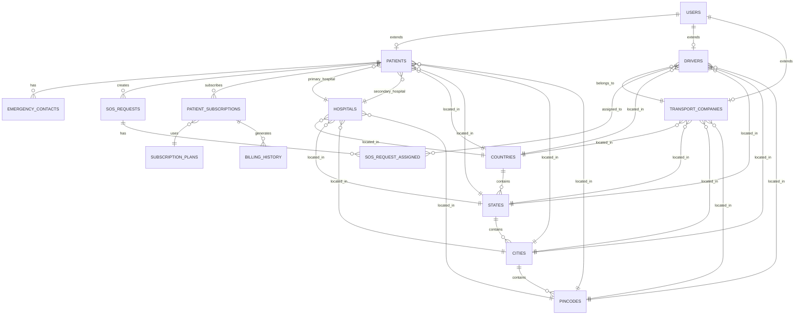

# 🗄️ Emergency Response Platform - Database Schema Documentation

This document provides a comprehensive overview of all database tables, their relationships, and the business logic implemented in the Emergency Response Management Platform.

---

## Table of Contents
1. [Database Overview](#database-overview)
2. [Core Tables](#core-tables)
3. [Entity Relationship Diagram](#entity-relationship-diagram)
4. [Table Details](#table-details)
5. [Foreign Key Relationships](#foreign-key-relationships)
6. [Business Logic](#business-logic)

---

## Database Overview

**Database Provider:** Supabase (PostgreSQL)

The platform uses a relational database with **15 main tables** organized into the following categories:

| Category | Tables |
|----------|--------|
| **User Management** | `users` |
| **Role-Specific Profiles** | `patients`, `drivers`, `transport_companies` |
| **Location Services** | `countries`, `states`, `cities`, `pincodes` |
| **Healthcare** | `hospitals`, `emergency_contacts` |
| **Emergency Operations** | `sos_requests`, `sos_request_assigned` |
| **Billing & Subscriptions** | `subscription_plans`, `patient_subscriptions`, `billing_history` |

---

## Core Tables

### 1. **users** (Central User Table)
The main authentication and user identity table. All role-specific data is linked via `user_id`.

```sql
CREATE TABLE public.users (
    id UUID DEFAULT gen_random_uuid() PRIMARY KEY,
    clerk_user_id VARCHAR(255) UNIQUE NOT NULL,
    email VARCHAR(255) UNIQUE NOT NULL,
    first_name VARCHAR(100),
    last_name VARCHAR(100),
    full_name VARCHAR(255),
    phone VARCHAR(20),
    bio TEXT,
    role VARCHAR(50) NOT NULL CHECK (role IN ('admin', 'ert', 'transport_company', 'patient', 'driver')),
    avatar_url TEXT,
    is_active BOOLEAN DEFAULT true,
    last_sign_in_at TIMESTAMP WITH TIME ZONE,
    created_at TIMESTAMP WITH TIME ZONE DEFAULT NOW(),
    updated_at TIMESTAMP WITH TIME ZONE DEFAULT NOW(),
    created_by VARCHAR(255),
    
    -- Profile fields
    date_of_birth DATE,
    gender VARCHAR(20),
    address TEXT,
    city VARCHAR(100),
    state VARCHAR(100),
    zip_code VARCHAR(20),
    country VARCHAR(100),
    
    -- Emergency contact
    emergency_contact_name VARCHAR(255),
    emergency_contact_phone VARCHAR(20),
    emergency_contact_relationship VARCHAR(100),
    
    -- Medical info (for patients)
    medical_conditions TEXT,
    allergies TEXT,
    medications TEXT,
    blood_type VARCHAR(10),
    
    -- Work info (for ERT, drivers)
    department VARCHAR(100),
    position VARCHAR(100),
    employee_id VARCHAR(50),
    
    -- Driver-specific
    license_number VARCHAR(100),
    license_class VARCHAR(50),
    license_expiry DATE,
    medical_cert_expiry DATE,
    years_experience VARCHAR(10),
    special_certifications TEXT,
    languages_spoken VARCHAR(255),
    current_shift VARCHAR(100),
    vehicle_assigned VARCHAR(50),
    rating DECIMAL(3,2) DEFAULT 0.0,
    total_trips INTEGER DEFAULT 0,
    last_trip TIMESTAMP WITH TIME ZONE,
    
    -- Preferences
    notification_preferences JSONB DEFAULT '{"email": true, "sms": false, "push": true}',
    language_preference VARCHAR(10) DEFAULT 'en',
    timezone VARCHAR(50) DEFAULT 'UTC'
);
```

**Key Fields:**
- `clerk_user_id`: Links to Clerk authentication
- `role`: Determines user access level
- `is_active`: Soft delete/deactivation flag

---

### 2. **patients** (Patient Profile Extension)
Extends user data with medical-specific information for users with `role = 'patient'`.

```sql
CREATE TABLE public.patients (
    user_id UUID PRIMARY KEY REFERENCES users(id),
    dob DATE,
    gender VARCHAR(10) CHECK (gender IN ('Male', 'Female', 'Other')),
    blood_group VARCHAR(5) CHECK (blood_group IN ('A+', 'A-', 'B+', 'B-', 'O+', 'O-', 'AB+', 'AB-')),
    allergies TEXT,
    abha_id VARCHAR(50),  -- Ayushman Bharat Health Account ID
    
    -- Insurance
    insurance_provider VARCHAR(255),
    insurance_policy_number VARCHAR(100),
    insurance_valid_till DATE,
    
    -- Hospital Preferences
    primary_hospital_id UUID REFERENCES hospitals(id),
    secondary_hospital_id UUID REFERENCES hospitals(id),
    
    -- Legacy emergency contact (deprecated - use emergency_contacts table)
    emergency_contact_name VARCHAR(255),
    emergency_contact_phone VARCHAR(20),
    emergency_contact_relation VARCHAR(100),
    
    -- Location
    latitude DECIMAL(10, 8),
    longitude DECIMAL(11, 8),
    country_id UUID REFERENCES countries(id),
    state_id UUID REFERENCES states(id),
    city_id UUID REFERENCES cities(id),
    pincode_id UUID REFERENCES pincodes(id),
    address_line TEXT
);
```

---

### 3. **drivers** (Driver Profile Extension)
Extends user data for users with `role = 'driver'`.

```sql
CREATE TABLE public.drivers (
    user_id UUID PRIMARY KEY REFERENCES users(id),
    transport_company_id UUID REFERENCES transport_companies(user_id),
    license_number VARCHAR(50) NOT NULL,
    aadhar_number VARCHAR(12),
    is_verified BOOLEAN DEFAULT false,
    status VARCHAR(20) CHECK (status IN ('available', 'assigned', 'on_trip', 'inactive')) DEFAULT 'available',
    current_request_id UUID REFERENCES sos_requests(id),
    
    -- Real-time location
    latitude DECIMAL(10, 8),
    longitude DECIMAL(11, 8),
    last_updated_at TIMESTAMP WITH TIME ZONE DEFAULT NOW(),
    
    -- Address
    country_id UUID REFERENCES countries(id),
    state_id UUID REFERENCES states(id),
    city_id UUID REFERENCES cities(id),
    pincode_id UUID REFERENCES pincodes(id),
    address_line TEXT,
    
    -- Additional fields
    created_by UUID REFERENCES users(id),
    created_at TIMESTAMP WITH TIME ZONE DEFAULT NOW()
);
```

**Key Status Values:**
- `available`: Ready for assignment
- `assigned`: Assigned to an SOS but not yet en route
- `on_trip`: Currently transporting a patient
- `inactive`: Not available for assignments

---

### 4. **transport_companies** (Transport Company Profile)
Profile for users with `role = 'transport_company'`.

```sql
CREATE TABLE public.transport_companies (
    user_id UUID PRIMARY KEY REFERENCES users(id),
    company_name VARCHAR(255) NOT NULL,
    address_line TEXT,
    registration_number VARCHAR(100),
    license_valid_till DATE,
    is_verified BOOLEAN DEFAULT false,

    -- Location
    country_id UUID REFERENCES countries(id),
    state_id UUID REFERENCES states(id),
    city_id UUID REFERENCES cities(id),
    pincode_id UUID REFERENCES pincodes(id)
);
```

---

### 5. **hospitals** (Healthcare Facilities)
Stores information about hospitals in the network.

```sql
CREATE TABLE public.hospitals (
    id UUID DEFAULT gen_random_uuid() PRIMARY KEY,
    name VARCHAR(255) NOT NULL,
    phone VARCHAR(20),
    email VARCHAR(255),
    website VARCHAR(255),

    -- Classification
    type VARCHAR(50) CHECK (type IN ('government', 'private', 'specialty', 'other')),
    status VARCHAR(50) CHECK (status IN ('active', 'inactive', 'under_review', 'suspended')) DEFAULT 'active',

    -- Capacity
    total_beds INTEGER DEFAULT 0,
    available_beds INTEGER DEFAULT 0,
    icu_beds INTEGER DEFAULT 0,
    emergency_capacity INTEGER DEFAULT 0,

    -- Specialties (stored as array or JSON)
    specialties TEXT[],

    -- Operating Hours
    operating_hours_start TIME,
    operating_hours_end TIME,
    is_24_hours BOOLEAN DEFAULT false,

    -- Location
    latitude DECIMAL(10, 8),
    longitude DECIMAL(11, 8),
    country_id UUID REFERENCES countries(id),
    state_id UUID REFERENCES states(id),
    city_id UUID REFERENCES cities(id),
    pincode_id UUID REFERENCES pincodes(id),
    address_line TEXT,

    -- Metadata
    created_at TIMESTAMP WITH TIME ZONE DEFAULT NOW(),
    updated_at TIMESTAMP WITH TIME ZONE DEFAULT NOW()
);
```

---

## Location Tables (Hierarchical)

### 6. **countries**
```sql
CREATE TABLE public.countries (
    id UUID DEFAULT gen_random_uuid() PRIMARY KEY,
    name VARCHAR(100) NOT NULL UNIQUE
);
```

### 7. **states**
```sql
CREATE TABLE public.states (
    id UUID DEFAULT gen_random_uuid() PRIMARY KEY,
    country_id UUID NOT NULL REFERENCES countries(id) ON DELETE CASCADE,
    name VARCHAR(100) NOT NULL
);
```

### 8. **cities**
```sql
CREATE TABLE public.cities (
    id UUID DEFAULT gen_random_uuid() PRIMARY KEY,
    state_id UUID NOT NULL REFERENCES states(id) ON DELETE CASCADE,
    name VARCHAR(100) NOT NULL
);
```

### 9. **pincodes**
```sql
CREATE TABLE public.pincodes (
    id UUID DEFAULT gen_random_uuid() PRIMARY KEY,
    city_id UUID NOT NULL REFERENCES cities(id) ON DELETE CASCADE,
    code VARCHAR(10) NOT NULL
);
```

**Location Hierarchy:** `Country → State → City → Pincode`

---

## Emergency Operations Tables

### 10. **sos_requests** (Emergency Requests)
Core table for tracking emergency SOS requests.

```sql
CREATE TABLE public.sos_requests (
    id UUID DEFAULT gen_random_uuid() PRIMARY KEY,
    patient_id UUID NOT NULL REFERENCES patients(user_id),
    requested_at TIMESTAMP WITH TIME ZONE DEFAULT NOW(),
    assigned_at TIMESTAMP WITH TIME ZONE,
    completed_at TIMESTAMP WITH TIME ZONE,
    auto_assigned BOOLEAN DEFAULT false,
    status VARCHAR(50) NOT NULL CHECK (status IN (
        'SOS Triggered',
        'Driver Assigned',
        'Driver En Route',
        'Patient Picked Up',
        'At Hospital',
        'Completed',
        'Cancelled',
        'Transferred'
    )) DEFAULT 'SOS Triggered'
);
```

**SOS Status Lifecycle:**
1. `SOS Triggered` → Initial state when patient triggers emergency
2. `Driver Assigned` → Driver has been assigned to the request
3. `Driver En Route` → Driver is traveling to patient location
4. `Patient Picked Up` → Patient is in the ambulance
5. `At Hospital` → Arrived at hospital
6. `Completed` → Emergency resolved
7. `Cancelled` → Request cancelled
8. `Transferred` → Transferred to another driver/service

### 11. **sos_request_assigned** (Driver Assignments)
Junction table linking SOS requests to assigned drivers.

```sql
CREATE TABLE public.sos_request_assigned (
    id UUID DEFAULT gen_random_uuid() PRIMARY KEY,
    sos_request_id UUID NOT NULL REFERENCES sos_requests(id) ON DELETE CASCADE,
    driver_id UUID NOT NULL REFERENCES users(id),
    assigned_at TIMESTAMP WITH TIME ZONE DEFAULT NOW(),
    status VARCHAR(50) DEFAULT 'assigned'
);
```

### 12. **emergency_contacts** (Patient Emergency Contacts)
Multiple emergency contacts per patient.

```sql
CREATE TABLE public.emergency_contacts (
    id UUID DEFAULT gen_random_uuid() PRIMARY KEY,
    patient_id UUID NOT NULL REFERENCES patients(user_id) ON DELETE CASCADE,
    name VARCHAR(255) NOT NULL,
    phone VARCHAR(20) NOT NULL,
    relationship VARCHAR(100),
    created_at TIMESTAMP WITH TIME ZONE DEFAULT NOW(),
    updated_at TIMESTAMP WITH TIME ZONE DEFAULT NOW()
);
```

---

## Billing & Subscription Tables

### 13. **subscription_plans** (Available Plans)
Defines subscription plans available for patients.

```sql
CREATE TABLE public.subscription_plans (
    id UUID DEFAULT gen_random_uuid() PRIMARY KEY,
    name VARCHAR(100) NOT NULL,
    description TEXT,
    price DECIMAL(10, 2) NOT NULL,
    duration_days INTEGER NOT NULL,
    is_active BOOLEAN DEFAULT true,
    created_at TIMESTAMP WITH TIME ZONE DEFAULT NOW(),
    updated_at TIMESTAMP WITH TIME ZONE DEFAULT NOW()
);
```

### 14. **patient_subscriptions** (Active Subscriptions)
Tracks patient subscriptions to plans.

```sql
CREATE TABLE public.patient_subscriptions (
    id UUID DEFAULT gen_random_uuid() PRIMARY KEY,
    patient_id UUID NOT NULL REFERENCES patients(user_id),
    plan_id UUID NOT NULL REFERENCES subscription_plans(id),
    start_date DATE NOT NULL,
    end_date DATE NOT NULL,
    status VARCHAR(20) CHECK (status IN ('active', 'expired', 'cancelled')) DEFAULT 'active',
    auto_renew BOOLEAN DEFAULT false,
    created_at TIMESTAMP WITH TIME ZONE DEFAULT NOW(),
    updated_at TIMESTAMP WITH TIME ZONE DEFAULT NOW()
);
```

### 15. **billing_history** (Payment Records)
Tracks all payment transactions.

```sql
CREATE TABLE public.billing_history (
    id UUID DEFAULT gen_random_uuid() PRIMARY KEY,
    patient_id UUID NOT NULL REFERENCES patients(user_id),
    subscription_id UUID NOT NULL REFERENCES patient_subscriptions(id),
    amount DECIMAL(10, 2) NOT NULL,
    currency VARCHAR(3) DEFAULT 'INR',
    payment_method VARCHAR(50),
    payment_gateway VARCHAR(50),
    transaction_id VARCHAR(255) NOT NULL,
    status VARCHAR(20) CHECK (status IN ('pending', 'paid', 'failed', 'refunded')) DEFAULT 'pending',
    invoice_url TEXT,
    metadata JSONB,
    created_at TIMESTAMP WITH TIME ZONE DEFAULT NOW()
);
```

---

## Entity Relationship Diagram



---

## Foreign Key Relationships Summary

| Table | Foreign Key | References | Relationship |
|-------|-------------|------------|--------------|
| `patients` | `user_id` | `users(id)` | 1:1 |
| `patients` | `primary_hospital_id` | `hospitals(id)` | N:1 |
| `patients` | `secondary_hospital_id` | `hospitals(id)` | N:1 |
| `patients` | `country_id` | `countries(id)` | N:1 |
| `patients` | `state_id` | `states(id)` | N:1 |
| `patients` | `city_id` | `cities(id)` | N:1 |
| `patients` | `pincode_id` | `pincodes(id)` | N:1 |
| `drivers` | `user_id` | `users(id)` | 1:1 |
| `drivers` | `transport_company_id` | `transport_companies(user_id)` | N:1 |
| `drivers` | `current_request_id` | `sos_requests(id)` | N:1 |
| `transport_companies` | `user_id` | `users(id)` | 1:1 |
| `states` | `country_id` | `countries(id)` | N:1 |
| `cities` | `state_id` | `states(id)` | N:1 |
| `pincodes` | `city_id` | `cities(id)` | N:1 |
| `hospitals` | `country_id`, `state_id`, `city_id`, `pincode_id` | Location tables | N:1 |
| `sos_requests` | `patient_id` | `patients(user_id)` | N:1 |
| `sos_request_assigned` | `sos_request_id` | `sos_requests(id)` | N:1 |
| `sos_request_assigned` | `driver_id` | `users(id)` | N:1 |
| `emergency_contacts` | `patient_id` | `patients(user_id)` | N:1 |
| `subscription_plans` | - | - | Standalone |
| `patient_subscriptions` | `patient_id` | `patients(user_id)` | N:1 |
| `patient_subscriptions` | `plan_id` | `subscription_plans(id)` | N:1 |
| `billing_history` | `patient_id` | `patients(user_id)` | N:1 |
| `billing_history` | `subscription_id` | `patient_subscriptions(id)` | N:1 |

---

## Business Logic

### 1. User Registration Flow
```
1. User signs up via Clerk
2. Clerk webhook triggers → Creates record in `users` table
3. Based on role:
   - patient → Creates record in `patients` table
   - driver → Creates record in `drivers` table
   - transport_company → Creates record in `transport_companies` table
```

### 2. SOS Request Lifecycle
```
1. Patient triggers SOS → Creates `sos_requests` record (status: 'SOS Triggered')
2. ERT assigns driver → Creates `sos_request_assigned` record
3. Driver status updated → 'assigned'
4. SOS status progression:
   'SOS Triggered' → 'Driver Assigned' → 'Driver En Route' →
   'Patient Picked Up' → 'At Hospital' → 'Completed'
5. On completion → Driver status returns to 'available'
```

### 3. Driver Assignment Logic
```
1. ERT views available drivers (status = 'available')
2. Selects driver based on:
   - Proximity to patient (latitude/longitude)
   - Driver availability
   - Transport company verification
3. Creates assignment in `sos_request_assigned`
4. Updates driver status to 'assigned'
5. Updates `current_request_id` in drivers table
```

### 4. Subscription & Billing Flow
```
1. Admin creates subscription plans in `subscription_plans`
2. Patient subscribes → Creates `patient_subscriptions` record
3. Payment processed → Creates `billing_history` record
4. Subscription status tracked (active/expired/cancelled)
5. Auto-renewal handled based on `auto_renew` flag
```

### 5. Location Hierarchy Usage
```
1. Admin manages master data: Countries → States → Cities → Pincodes
2. When creating/editing entities:
   - Select Country → Filters available States
   - Select State → Filters available Cities
   - Select City → Filters available Pincodes
3. Used for: Patients, Drivers, Hospitals, Transport Companies
```

---

## Data Access Patterns

### Common Supabase Query Patterns

**1. Fetching Patient with All Relations:**
```typescript
supabase
  .from('patients')
  .select(`
    *,
    user:users!patients_user_id_fkey(id, full_name, email, phone),
    primary_hospital:hospitals!patients_primary_hospital_id_fkey(id, name),
    secondary_hospital:hospitals!patients_secondary_hospital_id_fkey(id, name),
    country:countries(id, name),
    state:states(id, name),
    city:cities(id, name),
    pincode:pincodes(id, code),
    emergency_contacts(*)
  `)
```

**2. Fetching SOS Requests with Patient and Driver:**
```typescript
supabase
  .from('sos_requests')
  .select(`
    *,
    patients!inner(
      user_id,
      users!inner(full_name, email, phone)
    ),
    sos_request_assigned(
      driver_id,
      users!inner(full_name, email, phone)
    )
  `)
```

**3. Fetching Drivers with Company:**
```typescript
supabase
  .from('drivers')
  .select(`
    *,
    user:users!drivers_user_id_fkey(id, full_name, email),
    transport_company:transport_companies!drivers_transport_company_id_fkey(
      user_id,
      company_name
    )
  `)
```

---

## Row Level Security (RLS)

The database implements RLS policies to ensure data security:

| Table | Policy | Description |
|-------|--------|-------------|
| `users` | `users_select_own` | Users can only read their own data |
| `patients` | `patients_select_own` | Patients can only access their own profile |
| `drivers` | `drivers_select_own` | Drivers can only access their own profile |
| `sos_requests` | `sos_requests_patient` | Patients can only see their own requests |
| `sos_requests` | `sos_requests_ert` | ERT can see all requests |
| `billing_history` | `billing_patient` | Patients can only see their own billing |

**Note:** Admin and ERT roles typically have broader access through service role keys or elevated policies.

---

## Summary

This database schema supports a comprehensive emergency response platform with:

- **Multi-role user management** with role-specific profile extensions
- **Hierarchical location services** for accurate addressing
- **Complete SOS lifecycle tracking** from trigger to completion
- **Subscription-based billing** with payment history
- **Hospital network management** with capacity tracking
- **Driver fleet management** with real-time status tracking

The schema is designed for scalability, data integrity, and efficient querying through proper foreign key relationships and indexing.

